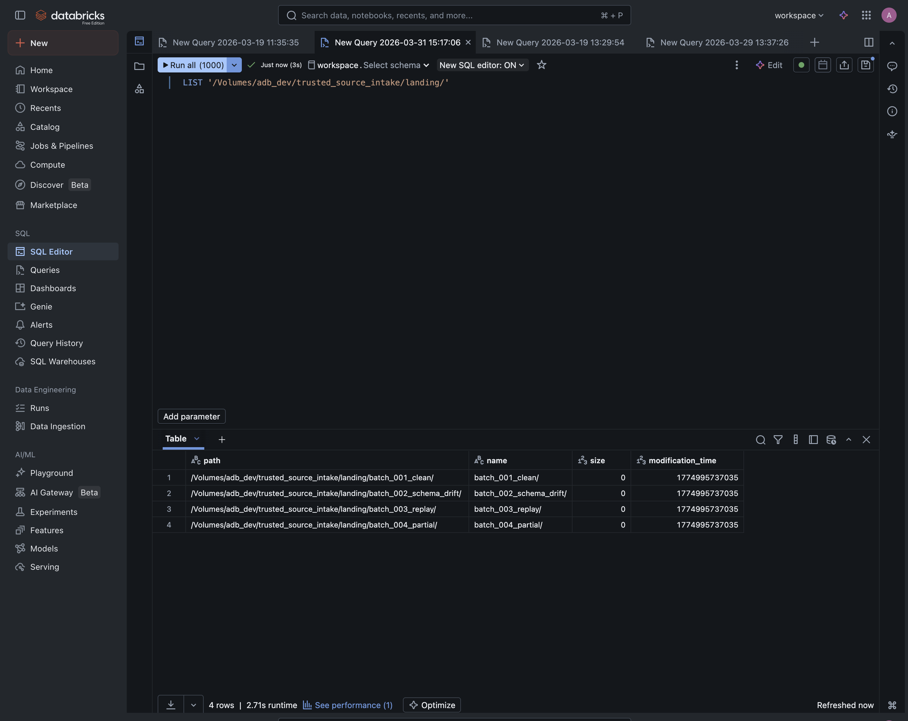
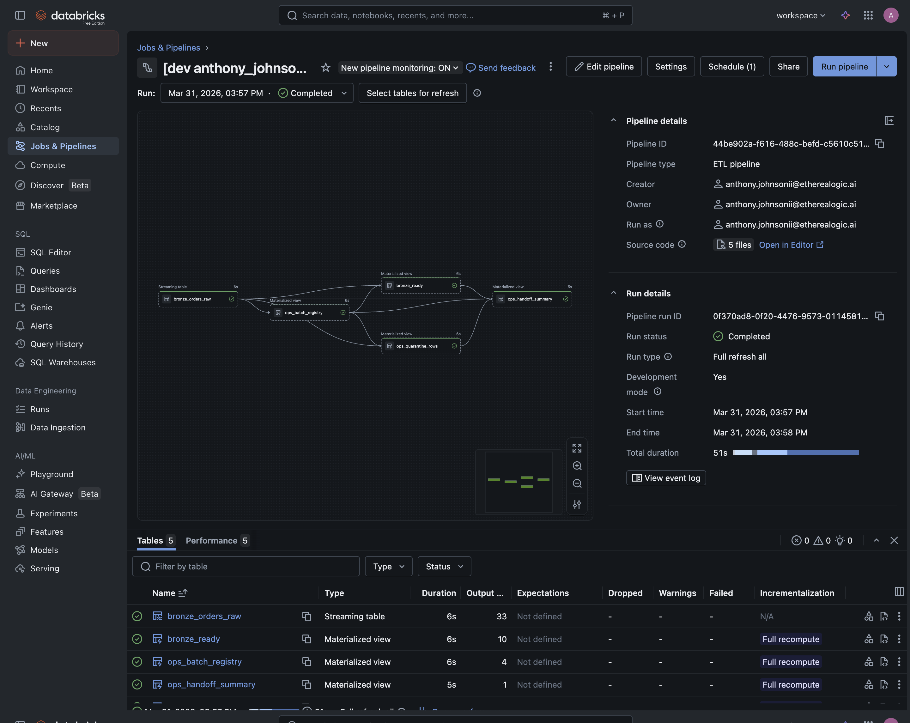
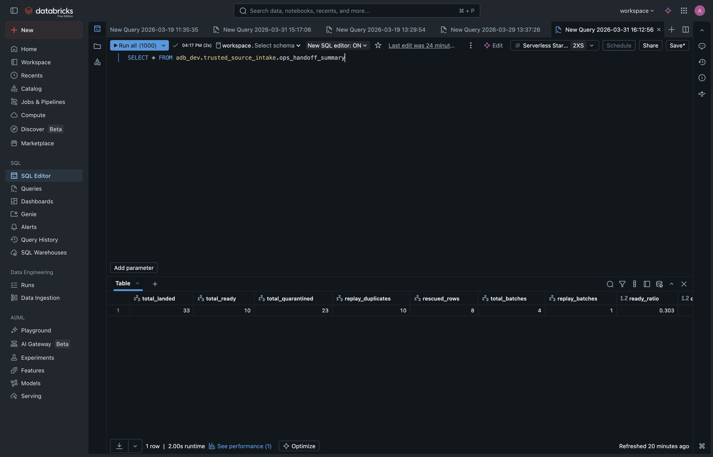
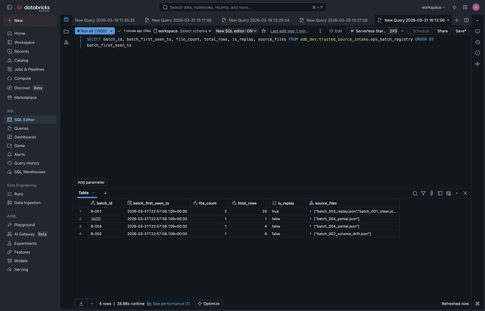
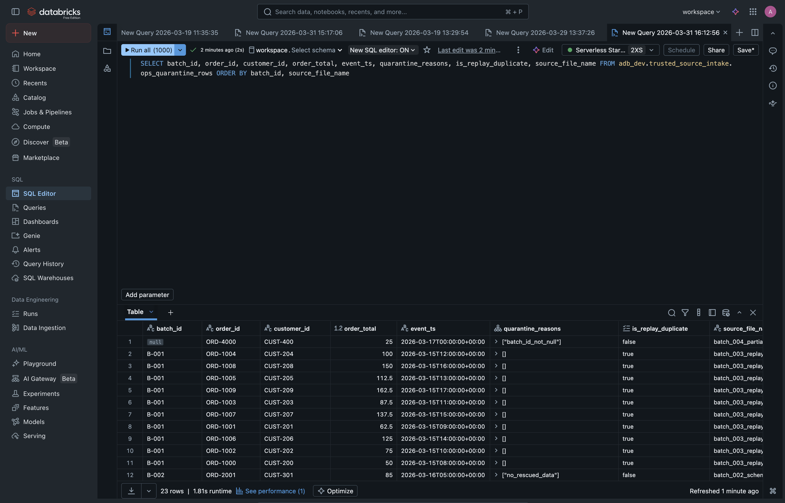
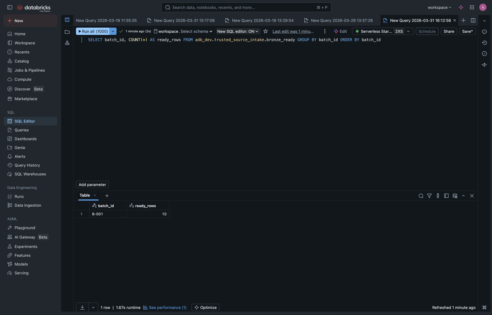

# Before Anyone Queries Bronze, How Do You Know the Data Is Ready?

[](https://app.codacy.com/gh/Org-EthereaLogic/trusted-source-intake?utm_source=github.com&utm_medium=referral&utm_content=Org-EthereaLogic/trusted-source-intake&utm_campaign=Badge_Grade)

**Enterprise Data Trust — Chapter 1: Trusted Source Intake**

Built by Anthony Johnson | EthereaLogic LLC

---

Data arrives from source systems on a schedule. Downstream consumers — dashboards, models, analysts — start querying as soon as it lands. Between those two events, there is usually no gate that validates whether the data is complete, unique, and contract-compliant.

This repository implements a **source intake control pattern** on Databricks that validates, quarantines, and certifies incoming data before downstream consumers are allowed to trust it.

## Executive summary

| Leadership question | Answer |
| ------------------- | ------ |
| What business risk does this address? | Source systems silently send duplicate batches, drop required fields, or change schemas without notice — and downstream consumers start using the data before anyone has validated it. |
| What does this solution demonstrate? | A four-component intake control that catches schema drift, blocks duplicate replays, quarantines invalid records with explicit reasons, and provides a single operational view of batch health. |
| Why does it matter? | Every decision made from the platform depends on the assumption that ingested data is complete, unique, and contract-compliant. This pattern enforces that assumption before anyone queries Bronze. |

## The business problem

Enterprise ingestion pipelines face four problems that consistently erode trust in the data platform:

**Schema drift goes unnoticed.** A source system adds a column, changes a data type, or renames a field. The pipeline absorbs the change silently. Downstream reports break — or worse, they produce numbers that look right but aren't.

**Duplicate batches slip through.** An operations team resends yesterday's file under a new name after a perceived failure. Without business-level deduplication, every downstream aggregate is inflated.

**Required fields arrive empty.** A partial extract from an upstream system produces rows where key business fields — customer identifiers, transaction amounts, event timestamps — are null. These rows pass basic schema checks because the columns exist.

**Consumers query before validation.** Downstream dashboards and models start reading from Bronze the moment data lands. There is no gate between "data arrived" and "data is ready."

These are not edge cases. They are the daily operational reality of enterprise data engineering — and they compound as source count increases.

## The approach

This solution implements four components that sit between file landing and downstream consumption:

**1. Raw ingest with rescued data.** Auto Loader captures everything, including schema changes, into a streaming table. Drift is rescued into a dedicated column rather than silently absorbed — making it visible for operational review.

**2. Batch registry.** A materialized view that groups ingested rows by business batch identifier and tracks first-seen timestamps, file counts, and replay flags. This provides business-level deduplication on top of the platform's file-level guarantees.

**3. Seven named contract checks.** Every row must pass all seven validation rules before reaching the ready output. Failed rows are quarantined with explicit reason arrays — not silently dropped, not quietly filtered.

**4. Operational handoff summary.** A single materialized view that aggregates the full pipeline into actionable metrics: landed, ready, quarantined, rescued, and duplicate counts with ratios.

## Verified evidence

The repository includes four test scenarios that exercise the most common enterprise intake failures:

| Scenario | What breaks | Verified outcome |
|----------|-------------|-----------------|
| Clean baseline | Nothing | All 10 rows pass to ready |
| Schema drift | New column, type change, field rename | All 8 rows rescued and quarantined with reasons |
| Duplicate replay | Same business batch, different file name | 10 rows flagged and blocked at the registry level |
| Partial payload | Null required fields, invalid amounts | All 5 rows quarantined with explicit violations |

The local demo runner produces the following handoff summary from 33 rows across 4 batches:

```text
Total landed:      33
Total ready:       10
Total quarantined: 23
Replay duplicates: 10
Rescued rows:      8
Ready ratio:       0.303
Quarantine ratio:  0.697
```

Regression coverage: `PYTHONPATH=src pytest tests/ -q` completes with `56 passed`.

## Decision / KPI contract

**Business decision:** should downstream users trust today's landed data?

The intake handoff summary answers that question with five KPIs:

| KPI | Meaning |
|-----|---------|
| `total_landed` | Rows ingested from source files |
| `total_ready` | Rows that passed all 7 contract checks and replay detection |
| `total_quarantined` | Rows blocked with explicit reason arrays |
| `replay_duplicates` | Rows from redelivered batches, blocked at the registry level |
| `rescued_rows` | Rows with schema drift captured in `_rescued_data` |

**Control rule:** only `bronze_ready` is downstream-safe. All other tables are operational surfaces for triage, audit, and replay investigation.

## Why this pattern

Raw ingest alone is not certification. A pipeline that absorbs every file without checking completeness, uniqueness, or schema conformance provides no basis for downstream trust.

This pattern addresses three gaps that standard ingestion leaves open:

- **Replay detection is business-level, not file-level.** The platform deduplicates files, but business teams resend the same batch under new filenames. The batch registry catches this.
- **Quarantine uses explicit reasons, not silent filtering.** Every blocked row carries an array of named check failures. Nothing is quietly dropped.
- **The handoff gate is a single view.** Operations teams inspect one summary table to decide whether today's data is safe to release.

## Architecture

```
Source Files
  → Landing Volume (Unity Catalog)
    → Auto Loader with rescued data mode
      → bronze_orders_raw (streaming table)
        → ops_batch_registry (replay detection)
        → ops_quarantine_rows (7 contract checks)
        → bronze_ready (certified output)
          → ops_handoff_summary (operational view)
```

The demonstration models a daily order-events source split into four sample batches, each designed to trigger a specific failure mode. The intake pattern — quarantine logic, replay protection, rescued data handling, and the handoff gate — is source-agnostic and applies to any enterprise ingestion pipeline regardless of source count.

For the full architecture diagram and design rationale, see [docs/architecture.md](docs/architecture.md).

## Platform alignment

This repository targets the Databricks Lakehouse platform:

- **Lakeflow Declarative Pipelines** (formerly DLT) for streaming ingestion and materialized views.
- **Auto Loader** with `cloudFiles` for incremental file processing with rescued data mode.
- **Unity Catalog** for governed table publication and volume-based landing zones.
- **Databricks Asset Bundles** for source-controlled deployment and pipeline refresh.

## Reproducibility

```bash
git clone https://github.com/Org-EthereaLogic/trusted-source-intake.git
cd trusted-source-intake

python -m venv .venv && source .venv/bin/activate
pip install -e ".[dev]"
PYTHONPATH=src pytest tests/ -q    # Expected: 56 passed
```

Run the local demo:

```bash
PYTHONPATH=src python -m intake.demo_metrics
```

For the full Databricks deployment path, see [docs/architecture.md](docs/architecture.md).

## Validated in Databricks Free Edition

The intake pipeline was deployed and executed in a live Databricks Free Edition workspace using serverless compute. The results below were captured from the SQL editor and pipeline UI after a full refresh of all four sample batches.

| Screenshot | What it proves |
|------------|---------------|
|  | 4 batch directories landed in the Unity Catalog volume |
|  | Pipeline completed: 5 tables, 0 warnings, 0 failures |
|  | 33 landed, 10 ready, 23 quarantined, 10 replay, 8 rescued |
|  | B-001 replay detected: file_count=2, is_replay=true |
|  | 23 rows quarantined with explicit reason arrays |
|  | B-001 = 10 ready rows — only the clean batch passes |

**Scope boundary:** this validates the intake control pattern on one order-events source across four sample batches in a Free Edition workspace. It does not constitute production-scale proof or multi-source verification.

## Additional documentation

- Architecture and design rationale: [docs/architecture.md](docs/architecture.md)
- Implementation case study: [docs/case_study.md](docs/case_study.md)

## Part of a series

This is **Chapter 1** of the *Enterprise Data Trust* portfolio — a three-part body of work addressing the full lifecycle of data reliability in enterprise Databricks platforms.

| Chapter | Focus | Repository |
|---------|-------|------------|
| **1. Trusted Source Intake** | Validate and certify data before downstream consumption | ← You are here |
| 2. Silent Failure Prevention | Detect distribution drift before it reaches executive dashboards | [silent-failure-prevention](https://github.com/Org-EthereaLogic/silent-failure-prevention) |
| 3. Measurable Control Effectiveness | Prove that your data controls work against known failure scenarios | [measurable-control-effectiveness](https://github.com/Org-EthereaLogic/measurable-control-effectiveness) |

---

<p align="left">
  <a href="https://github.com/Org-EthereaLogic/trusted-source-intake/actions/workflows/ci.yml"></a>
  <a href="https://app.codacy.com/gh/Org-EthereaLogic/trusted-source-intake/dashboard"></a>
  <a href="https://codecov.io/gh/Org-EthereaLogic/trusted-source-intake"></a>
</p>

MIT License. See [LICENSE](LICENSE.md) for details.
